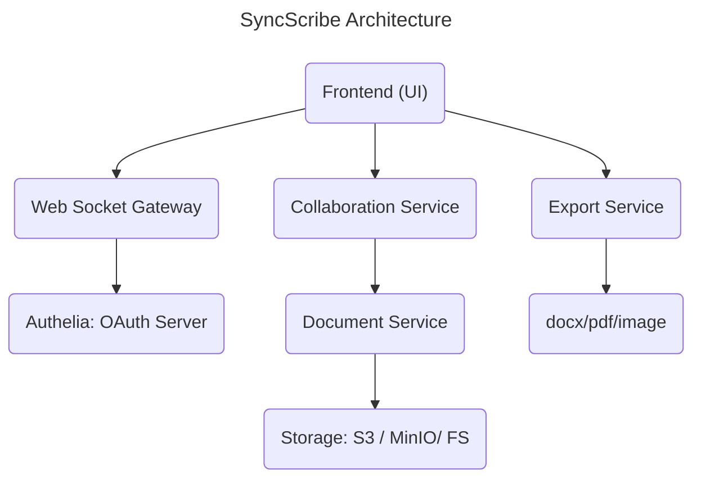

# SyncScribe Architecture

# Core Components

## 1. Text Editor Frontend
Use Quill.js or ProseMirror.
WebSocket connection to backend.
Highlight collaborators and their cursors.
Optimistic UI updates with buffering for network lag.

## 2. WebSocket Gateway
Accepts incoming real-time edits from clients.
Authenticates via JWT (use Spring Security).
Routes messages to collaboration service (possibly via Redis Streams/Kafka).

## 3. Collaboration Engine
The brain of the system: merges concurrent changes.
Two main approaches:
OT (Operational Transformation) – e.g. Google Docs style.
CRDT (Conflict-Free Replicated Data Types) – newer, more modern (e.g., Yjs, Automerge).
Implement a custom CRDT in Java for deep learning, or integrate with Yjs via WebAssembly or a bridge.
## 4. Document Service
CRUD APIs for documents.
Versioning and autosaving.
Permissions & sharing (read/write access).
Store metadata in PostgreSQL, actual content in blob store or DB (depending on size).
## 5. Auth Service
Spring Security with JWT.
OAuth2 integration if needed (Google login, etc).
Role-based access: editor, viewer, admin.
## 6. Storage Layer
Document metadata → PostgreSQL
Real-time state cache → Redis (for collaboration state).
File uploads (images in docs?) → MinIO or S3-compatible storage.

# Stretch Features
- Cursor presence & name tags.
- Version history & diff view.
- Comments & inline discussions.
- Export to PDF, DOCX.
- Offline sync.
- Mobile client (later).

# Tech Stack (Java-Centric)

|Layer|	Tech|
|--- |--|
|Frontend (optional)	|Quill.js / ProseMirror, React / Vue |
|WebSocket Backend	|Spring WebSocket / Netty|
|Auth |	Spring Security, JWT, OAuth72
|Collaboration Logic |	Java custom CRDT or bridge to Yjs via WebAssembly |
|Messaging	| Redis Streams or Apache Kafka |
|Storage	| PostgreSQL, Redis, MinIO / AWS S3 |
|Deployment	| Docker, Kubernetes, ArgoCD |
|CI/CD	| GitHub Actions / GitLab CI |