# Setup Zitadel

This developer guide will outline how to set up Zitadel to prepare for the
authentication of Spring Boot applications using ``jwt`` and ``opaque`` access tokens.
However, ``SyncScribe.io`` is using ``jwt`` instead of ``opaque``.


## JWT based access client flow

1. Create a new service user

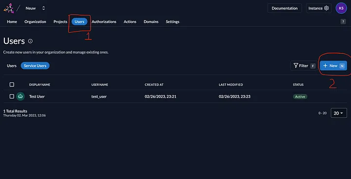

2. Make sure to set access token type to JWT.

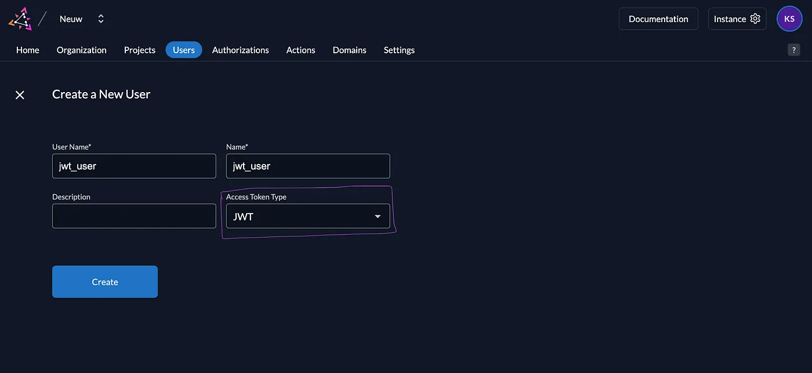

3. Generate the client secret

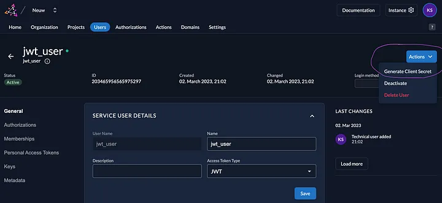

4. update the ``application.properties`` in the source code with the client and secret, in the following properties:-

```properties
spring.security.oauth2.client.registration.jwt.client-id=<client_id_for_jwt_token_client>
spring.security.oauth2.client.registration.jwt.client-secret=<client_secret_for_jwt_token_client>
```

## Opaque access token
1. Create new user


2. Make sure Access Token Type is Bearer

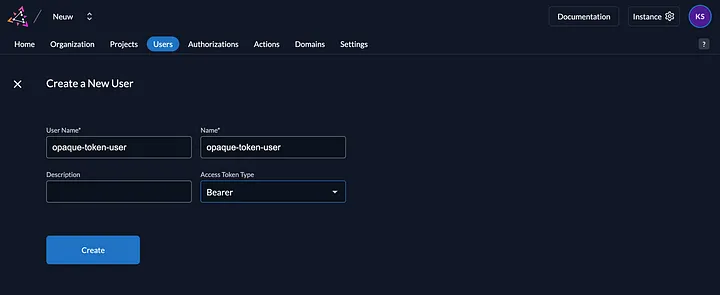

3. Generate Client secret and secure the secret for later use and replace them in the ``application.properties`` for the below properties.

```properties
spring.security.oauth2.client.registration.opaque.client-id=<client_id_for_opaque_token>
spring.security.oauth2.client.registration.opaque.client-secret=<client_secret_for_opaque_token>
```

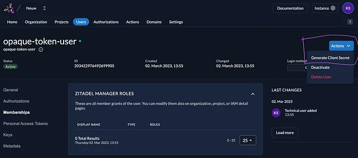

4. Create a new project & add the previously created service user to Authorizations of the project (add roles if required for authorization, else you may skip adding roles)

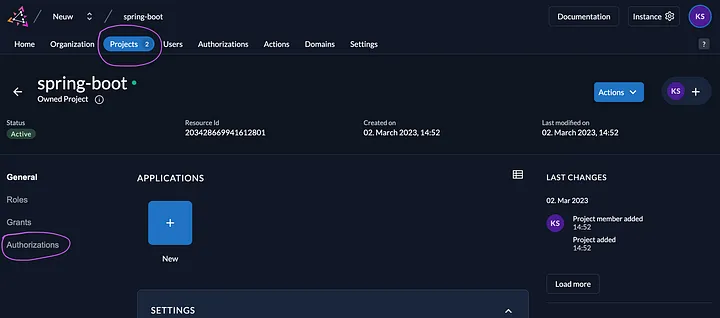

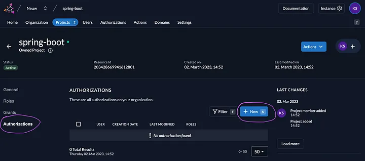

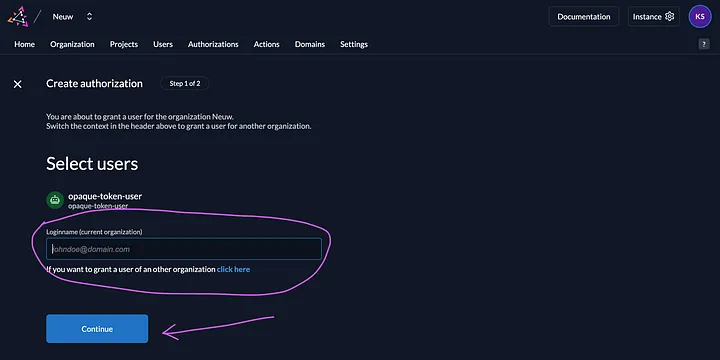

5. In the general tab of the project, copy the project resource id and replace <project_resource_id_put_here> with it in the following property of ``application.properties`` file:

```properties
spring.security.oauth2.client.registration.opaque.scope[0]=urn:zitadel:iam:org:project:id:<project_resource_id_put_here>:aud
```

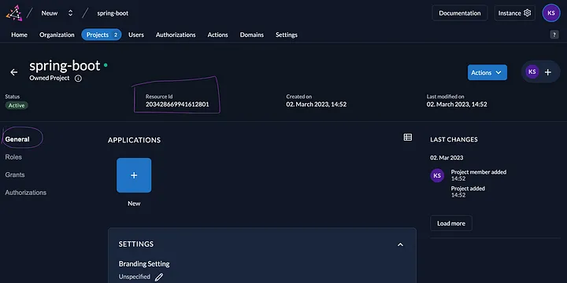

Below is the sample of oauth2 client configuration

```properties
# replace with domain of zitadel instance
zitadel.base.url=https://zitadel_instance_domain
zitadel.jwt.registration.name=jwt # the name of the client registration for JWT tokens
zitadel.opaque.registration.name=opaque # the name of the client registration for opaque tokens

# downstream base path
resource.server.basepath=http://localhost:8082

# client configuration for the JWT based access token
# jwt is a dynamic value after spring.security.oauth2.client.registration.*
spring.security.oauth2.client.registration.jwt.provider=zitadel-jwt-provider
spring.security.oauth2.client.registration.jwt.authorization-grant-type=client_credentials
spring.security.oauth2.client.registration.jwt.client-id=<client_id_for_jwt_token_client>
spring.security.oauth2.client.registration.jwt.client-secret=<client_secret_for_jwt_token_client>

# client configuration for the opaque access token
# opaque is a dynamic value after spring.security.oauth2.client.registration.*
spring.security.oauth2.client.registration.opaque.provider=zitadel-opaque-provider
spring.security.oauth2.client.registration.opaque.authorization-grant-type=client_credentials
spring.security.oauth2.client.registration.opaque.client-id=<client_id_for_opaque_token>
spring.security.oauth2.client.registration.opaque.client-secret=<client_secret_for_opaque_token>
spring.security.oauth2.client.registration.opaque.scope[0]=urn:zitadel:iam:org:project:id:<project_resource_id_put_here>:aud

# the providers for the token uri configs, these are referred above in the client registration
spring.security.oauth2.client.provider.zitadel-jwt-provider.token-uri=${zitadel.base.url}/oauth/v2/token
spring.security.oauth2.client.provider.zitadel-opaque-provider.token-uri=${zitadel.base.url}/oauth/v2/token
```

## Resource Server configuration

The ``application.properties`` are:

```properties
# replace with domain of zitadel instance
zitadel.base.url=https://zitadel_instance_domain

spring.security.oauth2.resourceserver.jwt.issuer-uri=${zitadel.base.url}

spring.security.oauth2.resourceserver.opaquetoken.client-id=<client_id_of_the_zitadel_api_app>
spring.security.oauth2.resourceserver.opaquetoken.client-secret=<client_secret_of_the_zitadel_api_app>
spring.security.oauth2.resourceserver.opaquetoken.introspection-uri=${zitadel.base.url}/oauth/v2/introspect
```

1. Create a new app in the project you previously created above, Create that new app as below:

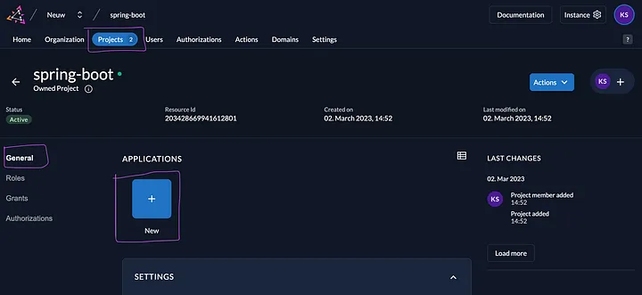

2. Enter a name and make sure the type of application is API

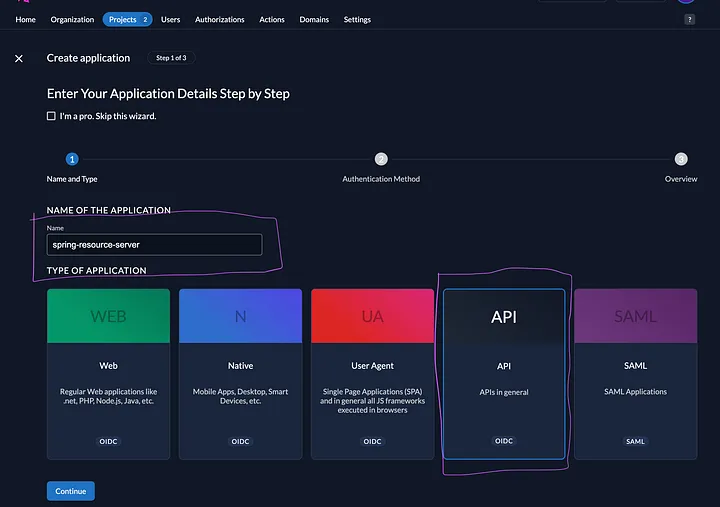

3. Make sure the Authentication method is BASIC & click on Continue and then Create

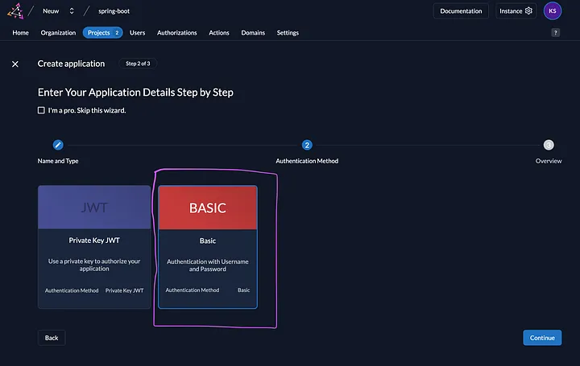

4. next screen, copy the client id and secret and place them in the following properties of the resource server’s ``application.properties``

```properties
spring.security.oauth2.resourceserver.opaquetoken.client-id=<client_id_of_the_zitadel_api_app>
spring.security.oauth2.resourceserver.opaquetoken.client-secret=<client_secret_of_the_zitadel_api_app>
```


## Appendix
### Jwt Token vs Opaque Token

| Jwt Token                                                                                              | Opaque Token                                                                                                                                                                                                                             |
|--------------------------------------------------------------------------------------------------------|------------------------------------------------------------------------------------------------------------------------------------------------------------------------------------------------------------------------------------------|
| **Self-contained:** JWTs contain all necessary user information (claims) within the token itself.      | Opaque tokens are unique identifiers (e.g., session IDs, database keys) that point to user data stored on a server.                                                                                                                      |
| **Stateless:** Resource servers can validate JWTs locally without needing to query a backend database. | **Not stateless:** To validate an opaque token, a resource server needs to query the server to verify its validity.                                                                                                                      |
| **Scalable:** JWTs are well-suited for distributed systems where fast token validation is crucial.     | **Easily revocable:** If a token is revoked, it can be deleted from the server, and any future use of that token will fail. However it might be slower than JWT since database check is required. This can be overcome by using Caching. |
| **Format:** JWTs are a structured JSON object that is encoded and signed.                              | Opaque tokens are essentially random, unique strings used as references to session data stored on the authorization server.                                                                                                              |
| **Potential drawbacks:** Sensitive data within a JWT can be exposed if compromised.                    | **More secure:** Since opaque tokens don't expose user data, they can be more secure in environments where data exposure is a concern.                                                                                                   |
| Ideal for stateless, scalable applications where fast token validation is needed.                      | Better suited for environments where revocation is critical and data exposure needs to be minimized.                                                                                                                                     |
| **Example:** User ID, roles, expiration time.                                                          | **Example:** A random string that maps to user session data.                                                                                                                                                                             |
